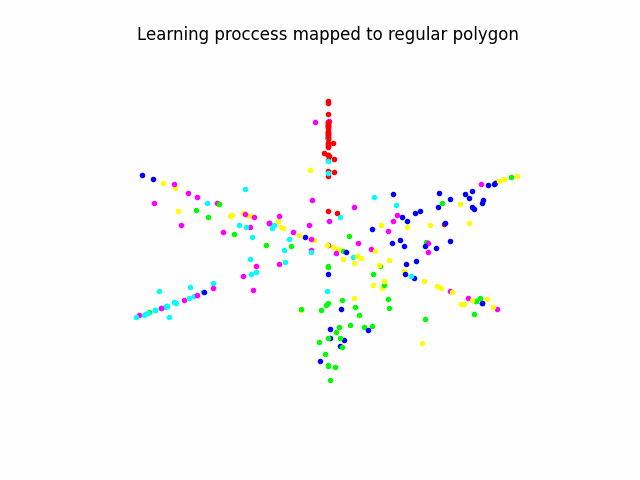

# DAC-Tensorflow2.x
Implementation of the DAC model on TF 2.13.0, tested on the MNIST and cifar10 datasets, and applied for biomedical research on A549 cells exposed to Particulate Matter.

GIF shows DAC model learning process differentiating between A549_PhaD_20x monolayers exposed to 6 different concentrations of TiO2 microparticles.
